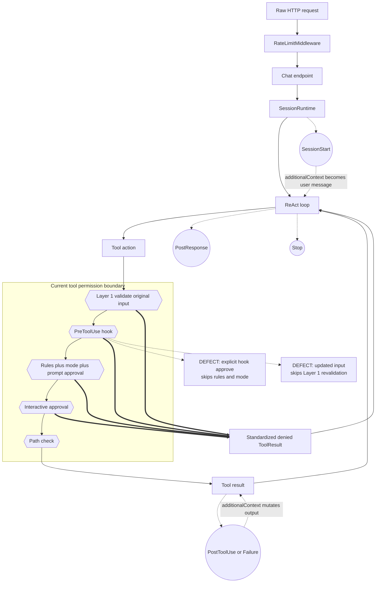
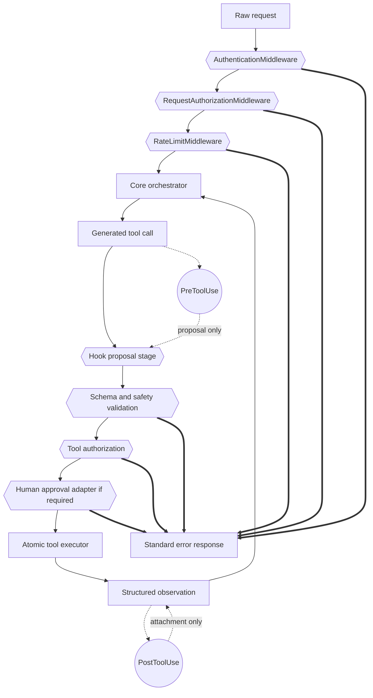

# Core Architecture Refactoring and Responsibility Alignment

## Implementation checkpoint (updated 2026-07-24)

The completed execution slices are covered by regression tests:

| Ticket | Status | Implemented boundary |
|---|---|---|
| P0 permission/hook invariants | Complete | Hook proposals can no longer bypass schema, safety, deny rules, mode policy, or updated-input revalidation; per-call state is isolated. |
| P0 hook failure semantics | Complete | Internal blockable failures fail closed; notification failures remain observable and fail open. |
| P0 tool execution owner | Complete | `ToolExecutionPipeline` is the single registry execution path. |
| P1-A context planning | Complete | Stateful `ContextPlanner` is the single normal in-turn decision owner for tool-result budgeting, Snip, MicroCompact, Collapse, and semantic Compact. `ContextManager` and `prepare_history_for_turn` execute its typed `ContextReductionPlan`; compactor decision methods are no longer called. Post-round persistence and prompt-too-long recovery remain intentionally separate policies. |
| P1 prompt isolation | Complete | `PromptRenderer` and `PromptConfig` are request scoped and injected through every CLI, chat, issue, validation, and server entrypoint; process-global compatibility setters and active renderer state were removed. |
| P1 ReAct seams | Complete | `_run_body` is a 213-line transition loop, down from 1,210 lines and below the planned 250-line gate. Run setup, pre-step enforcement, provider request/recovery/action acceptance, terminal handling, tool execution, observation reduction, and post-observation policy are explicit typed seams with focused regression coverage. |
| P1 Web orchestration | Complete for the planned boundary | Frozen `ChatRequest` and `PreparedChatRun` replace the mutable pipeline context; `ChatPipelinePorts` exposes its exact dependencies, and summary claiming moved behind `SessionService` and public storage metadata APIs. |
| P2 Web tool contracts | Complete | WebSearch exposes typed `SearchResult` data while retaining compatibility output; WebFetch no longer advertises the unused `prompt` parameter. |
| P1 permission session wiring | Complete | Immutable `PermissionSessionConfig` and `ToolControlSignal` replace Runtime/Web/CLI private-field traversal; child inheritance and Hook dispatcher wiring use public registry ports. |
| P1 policy authority | Complete | `PolicyAwareToolRegistry` owns static visibility/effect/path policy only; permission mode is authorized once by `PermissionPipeline`. |
| P1 typed Hook attachments | Complete | Post-tool Hook context stays out of raw output and is rendered only by `ObservationRenderer`; user-prompt context also remains typed until its render boundary. |
| P1 server bind contract | Complete | Unauthenticated serving is loopback-only unless `--allow-remote` is explicit, in which case a prominent warning is emitted. |
| P2 compaction contract | Complete | Public `CompactionResult` reports method, truncation, and source range; Context Collapse no longer calls a private method and stats expose information loss. |
| P2-B lifecycle events | Complete | `UserPromptSubmit` is emitted before mention resolution, and `PermissionRequest` before the interactive approval callback. Both ordering contracts and blocking behavior have integration coverage. |
| P2-C tool permissions | Complete | `ToolMetadata.required_permissions` is declarative and immutable; WebSearch/WebFetch declare `network:search`/`network:fetch`, and the metadata reaches both PermissionRequest hooks and interactive approval requests. |
| P2 prompt contract | Complete | Tool usage rules are declarative `LLMToolSchema.prompt_contract` data and survive subagent snapshots; the assembler has no tool-name branch. |

Validation at this checkpoint: 168 non-service tests pass. `test_e2e_smoke.py`
requires a separately running server on port 8765 and is intentionally kept as
the service-level deployment gate.

All P1/P2 slices in this plan are complete. The audit findings and original
execution tickets remain below as historical design context. Remote
authentication is a separate deployment feature beyond the completed
loopback-only contract.

> Audit date: 2026-07-23  
> Scope: the active Web request path plus the shared ReAct, prompt, context,
> tool/search, permission, hook, and LLM boundaries.  
> Method: static tracing of the current repository. Line numbers refer to the
> repository state on the audit date.

## Executive verdict

Architecture health: **5/10**.

The project has the right nouns—`ChatPipeline`, `ContextManager`,
`PermissionPipeline`, `HookDispatcher`, `LLMInvoker`—but several are façades
around the same shared mutable runtime. The main problem is not a missing
abstraction. It is that existing boundaries are routinely crossed through
private fields, callbacks, globals, and in-place mutation.

The sharpest findings are:

1. **P0 — hook-modified tool input is not revalidated by the absolute safety
   layer.** `PermissionPipeline.check()` validates the original input at
   `hitl/pipeline.py:385-388`, then accepts `updatedInput` at `398-399` or
   `603-622`. An explicit hook approval also returns at `391-395` before deny,
   ask, and permission-mode evaluation.
2. **P0 — permission evaluation is mutable and unsafe under parallel tool
   execution.** `_pending_hook_updates` is shared instance state
   (`hitl/pipeline.py:350-352`), while tool calls are deliberately dispatched
   concurrently (`agent/core.py:1623-1659`).
3. **P0 — blockable internal-hook failures fail open.**
   `HookDispatcher._dispatch()` swallows internal-hook exceptions and continues
   (`hooks/dispatcher.py:83-92`) even for `PRE_TOOL_USE`, `STOP`, and the other
   events declared blockable in `hooks/events.py:48-53`.
4. **P1 — `ReActAgent._run_body()` is still the architecture.** Its
   `agent/core.py:763-2073` body owns orchestration, context pressure,
   compaction, protocol repair, tool scheduling, permission-circuit handling,
   memory extraction, verification, observability, and result production.
5. **P1 — request and prompt context are not isolated.**
   `prompts/builder.py:52-80` keeps process-global project/config/assembler
   state. A concurrent run can replace another run's project prompt resolver.
6. **P1 — the Web “pipeline” is coupled to service internals.**
   `ChatPipeline` reads private `AgentService` fields
   (`server/services/chat_pipeline.py:133-157`), mutates its allegedly
   immutable context (`105-120`), and reaches into the storage connection
   (`240-270`).

The WebSearch boundary is comparatively clean: `WebSearchTool` performs search
I/O and deterministic filtering without calling an LLM
(`tools/web_tool.py:103-177`). It should not be moved into the ReAct loop.

## Phase 1 — actual runtime flow

### Request to final answer

This is the code's current path, not a target diagram.

```mermaid
flowchart TD
    A[POST session messages<br/>sessions.py:377-460]
    B[ChatPipeline stages<br/>chat_pipeline.py:407-429]
    C[SessionRuntime.run_session<br/>runtime.py:850-1085]
    D[ReActAgent.run and run_body<br/>core.py:596-2073]
    E[ContextManager plus Prompt globals<br/>manager.py:86-213 / builder.py:52-161]
    F[LLM call then ToolRegistry boundary<br/>core.py:1166-1669]
    G[RunResult persisted and streamed<br/>runtime / EventLog / EventBus]

    A --> B --> C --> D
    D --> E --> F
    F -->|FINISH| G
    F -->|tool result appended to history| D

    X1{{PermissionPipeline<br/>hitl/pipeline.py}}
    X2((HookDispatcher<br/>hooks/dispatcher.py))
    X3[Context trimming and compaction<br/>core.py + context modules]

    F --> X1 -->|allow| F
    X1 ==>|deny ToolResult, but after an LLM call| D
    X2 -. PreToolUse approve deny mutate .-> X1
    F -. PostToolUse appends hook context .-> X2
    D -. Stop and PostResponse .-> X2
    D --> X3 --> E

    I1[ILLEGAL private field chain<br/>ReActAgent to registry base pipeline]
    I2[ILLEGAL callback cycle<br/>ContextManager to ReActAgent compactor]
    I3[ILLEGAL process-global prompt state]
    I4[CHOKE POINT<br/>run_body owns nearly every transition]

    D -. core.py:592 .-> I1
    E -. manager callbacks at core.py:2328-2329 .-> I2
    E -. builder.py:52-80 .-> I3
    D -. core.py:763-2073 .-> I4
```

### Main flow × permission × hooks



### Data-flow choke points

| Choke point | Evidence | Consequence |
|---|---|---|
| One giant turn owner | `agent/core.py:763-2073` | Any change to compaction, permissions, completion, or tools risks the entire loop. |
| Three compaction decision sites | `agent/core.py:1062-1150`, `context/manager.py:154-168`, `server/services/chat_pipeline.py:54-98` | Token pressure has competing triggers and counters; behavior depends on entry path and timing. |
| Prompt globals | `prompts/builder.py:52-80`, called by `agent/core.py:627` | Project overrides are process state rather than request data. |
| Private permission traversal | `agent/core.py:584-594`, `agent/session/runtime.py:941-964` | The orchestrator and session runtime know the permission implementation's object graph and fields. |
| Hook output mutation inside registry | `core/base.py:685-691` | Tool execution, lifecycle extension, and observation formatting are inseparable. |
| Persistence hidden inside context preparation | `server/services/chat_pipeline.py:240-270` | A method documented as context injection performs DB writes through a private connection. |

## Phase 2 — module responsibility violations

### Violation list

| Module | Current erroneous behavior | Proper responsibility | Level |
|---|---|---|---|
| `agent/core.py` — `ReActAgent._run_body()` | Performs pre-step policy, five forms of context reduction, LLM recovery, tool validation/batching, memory ticks, completion verification, hook dispatch, stats, and result formatting. | Advance an explicit turn state by delegating `prepare → generate → execute → reduce → complete`. | High |
| `agent/core.py` — `_circuit_breaker_tripped` | Traverses `_full_registry._base._permission_pipeline._terminate_session`. | Read a typed `RuntimeControlSignal` returned by the tool boundary. | High |
| `agent/core.py` — `_build_messages()` | Mutates `ContextManager._cfg`, builds prompts, caches repo maps, passes callbacks back into itself, and mutates the returned context. | Supply immutable inputs to a request-scoped context assembler and consume an immutable result. | High |
| `server/services/chat_pipeline.py` — `ChatExecutionContext` | Claims immutability but is a mutable dataclass populated stage by stage. | Frozen request input plus a separate explicit `PreparedChatRun` result. | Medium |
| `server/services/chat_pipeline.py` — `ChatPipeline` | Reaches through private service fields and combines preprocessing, model lifecycle, DB bookkeeping, thread creation, execution, plan persistence, and compaction scheduling. | Coordinate public ports; keep persistence and background execution in their owners. | High |
| `prompts/builder.py` | Stores active project/config/assembler in module globals. | Render a prompt from an injected, request-scoped `PromptAssembler`. | High |
| `prompts/assembler.py` — `_build_tool_contract_rules()` | Hard-codes shell-specific behavioral policy in a prompt assembler. | Render declarative contract text supplied by tool metadata. | Medium |
| `context/manager.py` — `build_request_messages()` | Decides compaction through callbacks, performs compaction, trims history, converts messages, adds synthetic assistant acknowledgement, and measures stats. | Assemble already-selected context layers under a supplied budget. | High |
| `context/compaction.py` — `ConversationCompactor` | Both decides/records compaction state and generates semantic summaries, with a regex fallback that truncates text. | Transform an explicitly selected message range and report provenance/loss. | Medium |
| `agent/context_trimming.py` — `_apply_context_collapse()` | Calls a private compactor method `_summarize_messages`. | Depend on a public `ContextSummarizer` contract. | High |
| `hitl/pipeline.py` — `PermissionPipeline.check()` | Combines safety, hooks, authorization rules, mode, prompt similarity, UI blocking, persistence, circuit breaking, and mutable session state. | Evaluate one immutable tool request and return one typed authorization decision. | High |
| `hitl/pipeline.py` — `_layer2_hooks()` | A hook can approve before deny/mode evaluation or rewrite input after safety validation. | Hooks may propose a transformed request; safety and authorization must evaluate the final request. | High |
| `core/base.py` — `ToolRegistry.execute_tool()` | Resolves tools, checks capability, authorizes, executes, dispatches hooks, mutates output, and records timing. | Registry resolves descriptors; a `ToolExecutor` owns the execution pipeline. | High |
| `hooks/dispatcher.py` — `_dispatch()` | Swallows internal hook failure, including blockable events; returns first explicit approval; mixes registry iteration with process execution policy. | Dispatch events and return all outcomes; caller applies fail policy by event. | High |
| `hooks/events.py` | Declares `USER_PROMPT_SUBMIT` and `PERMISSION_REQUEST`, but the audited runtime has no corresponding dispatch call. | Only expose implemented lifecycle events, or wire them at their real boundary. | Medium |
| `tools/web_tool.py` — `WebSearchTool.execute()` | Returns presentation-formatted text rather than structured results. | Return a typed result list; render only at the LLM observation boundary. | Low |
| `tools/web_tool.py` — `WebFetchTool` | Documents prompt-based relevance filtering, but `prompt` is read and unused (`225-228`, `318-328`). | Either implement a separate deterministic post-processor or remove the parameter/claim. | Medium |

### What is already correctly placed

- The ReAct loop does **not** hard-code DuckDuckGo or WebSearch strategy.
- `WebSearchTool` performs network I/O, retry, domain filtering, and bounded
  result extraction within the tool boundary.
- `LLMInvoker` is already separated from task/tool/session knowledge
  (`llm/invoker.py:59-231`); keep that boundary.
- Tool effects and path access are declarative in frozen `ToolMetadata`
  (`core/types.py:177-186`). Extend this contract instead of adding decorators
  and a second metadata system.
- Hook matching and external process execution are separated into `registry`,
  `matcher`, `dispatcher`, and `executor`; the needed change is contract
  tightening, not a new hook framework.

### Permission-specific audit

Authentication, authorization, and safety are currently conflated or absent:

| Concern | Current state | Judgment |
|---|---|---|
| Authentication — who is calling | No authentication middleware is registered in `server/main.py:117-177`; endpoints receive only `AgentService`. Default bind is loopback, so this is acceptable only for a strictly local product. | P1 hardening; P0 before any non-loopback deployment. |
| Request authorization — which session/resource the caller owns | No immutable principal/tenant/session ownership context exists. Session IDs act as bearer locators. | Missing boundary. |
| Tool authorization — what effect is allowed | Split between `PhasePolicy`, `PolicyAwareToolRegistry`, and `PermissionPipeline`. | Duplicated authority with inconsistent ordering. |
| Safety/guardrails — whether a concrete action is safe | Split between tool-local `permission_denial_reason`, `PermissionPipeline` Layer 1/5, policy registry, and tool implementations. | Defense in depth is useful, but ownership and order are not explicit. |
| Human approval | Blocking callbacks live inside `PermissionPipeline`. | Interaction transport is incorrectly embedded in policy evaluation. |

### Hook-specific audit

The hooks are optional in shape but not consistently isolated:

- `SessionStart` additional context is inserted into model history
  (`agent/session/runtime.py:1070-1083`). This is a supported enhancement, but
  it is prompt-affecting and must be visibly typed as such.
- `PostToolUse` additional context mutates `ToolResult.output`
  (`core/base.py:685-691`). Store it as a separate observation attachment so
  raw tool data remains raw.
- `Stop` is a blocking completion policy embedded directly in the ReAct loop
  (`agent/core.py:1459-1480`). The loop should consume a typed completion
  decision without knowing hook retry semantics.
- `PostResponse` is dispatched directly by the loop
  (`agent/core.py:953-956`, `2145-2166`). It is a legitimate non-blocking
  notification, but failures should be observable rather than silently lost.

### Interface contract review

| Component | Current signature | Diagnosis | Target signature |
|---|---|---|---|
| Permission boundary | `PermissionPipeline.check(tool, params, thought="") -> PermissionResult` (`hitl/pipeline.py:354-516`) | Takes a mutable tool object and untyped dict, uses instance scratch state, and performs UI interaction. | `authorize(request: ToolCallRequest, metadata: ToolMetadata, policy: PermissionPolicy) -> AuthorizationDecision` |
| Tool execution | `ToolRegistry.execute_tool(name, params, thought="") -> ToolResult` (`core/base.py:602-694`) | Registry, policy, hook, execution, rendering, and timing responsibilities are fused. | `ToolExecutor.execute(call: AuthorizedToolCall) -> ToolExecutionResult` |
| Pre-tool hook | `HookDispatcher.dispatch(event, context) -> DispatchResult` (`hooks/dispatcher.py:51-58`) | Generic result allows approval to acquire policy authority and does not express failure policy. | `propose_tool_call(context: ReadonlyHookContext) -> HookProposal` |
| Context assembly | `ContextManager.build_request_messages(..., compactor_fn, should_compact_fn, ...) -> RequestContext` (`context/manager.py:86-213`) | Callback cycle lets the caller remain the real compaction owner. | `ContextPlanner.plan(input: ContextInput, budget: ContextBudget) -> ContextPlan` |
| Prompt rendering | `build_system_prompt_core(repo_path, tools, repo_summary) -> str` through module globals (`prompts/builder.py:128-161`) | Signature looks pure but behavior depends on the active global assembler/project/config. | `PromptRenderer.render_system(input: SystemPromptInput) -> PromptRenderResult` |
| Web search | `WebSearchTool.execute(params) -> ToolResult[str]` (`tools/web_tool.py:103-177`) | Atomic I/O is correct; string output loses structure. | `search(request: SearchRequest) -> ToolResult[tuple[SearchResult, ...]]` |
| Post-search/fetch processing | No explicit contract; `WebFetchTool` accepts an unused `prompt` (`tools/web_tool.py:236-238`) | Schema promises relevance behavior that does not exist. | `select_relevant_sections(document: FetchedDocument, query: str) -> SelectionResult` only if needed |

## Phase 3 — gap from a pure, streaming agent core

The comparison below uses the requested Claude Code mental model—thin
orchestration, atomic tool calls, explicit context, permission at system/tool
boundaries—not undocumented claims about its private implementation.

| Dimension | Current implementation | Target |
|---|---|---|
| Core loop | One method owns state, policies, compression, tools, hooks, recovery, verification, and formatting. | A small state transition loop calling explicit collaborators. |
| Context-window use | Three compaction triggers; repeated task anchors; synthetic memory acknowledgement; repo map and memory recomputed/cached through agent state. | One `ContextPlan` per turn with provenance, budget, selected layers, and one reduction decision. |
| Tool atomicity | Registry wraps capability, permission, execution, post-hooks, output mutation, timing. | `ToolExecutor.execute(AuthorizedToolCall) -> ToolExecutionResult`; each stage is typed and independently testable. |
| Streaming | Tool execution can start while LLM streaming is active, but permission evaluation uses shared mutable state. | Per-call immutable authorization permits safe speculative concurrency. |
| Prompt purity | Module globals and shell-specific conditionals. | Request-scoped renderer; dynamic facts and tool contracts supplied as data. |
| Permission clarity | Phase policy, permission pipeline, local tool safety, hooks, and UI callbacks overlap. | Authentication before core; authorization and safety at tool boundary; approval is a separate adapter. |
| Hook decoupling | Hooks can bypass policy, mutate final input/output, and fail open. | Hooks emit proposals/attachments; mandatory stages validate any proposed mutation. |
| Web search | Correctly isolated from the core, but string-formatted and WebFetch overstates prompt filtering. | Typed raw search/fetch results plus optional deterministic post-processing. |
| Failure path | Many failures become user messages and spend another LLM turn; some hook errors disappear. | Typed failures short-circuit where safe, while recoverable tool denials remain explicit observations. |

### Pragmatic engineering-manager counterargument

Do **not** turn this plan into a framework rewrite.

- Replacing every `if` with stages, strategies, factories, and an event bus
  would cost more than it returns. Use plain functions and frozen dataclasses.
- Do not create a second tool metadata system. Add `required_permissions` and
  any missing safety facts to existing `ToolMetadata`.
- Do not split `_run_body()` into twenty classes in one change. First extract
  three seams—turn preparation, tool execution, completion—and retain behavior.
- Do not move WebSearch summarization into the core. The current absence of an
  LLM summarizer inside the tool is a strength.
- Do not add authentication complexity if the server is contractually
  loopback-only. Instead, enforce loopback binding. Add identity middleware only
  when remote/multi-user serving is a real supported mode.
- Do not make all hook errors fatal. Only blockable security/permission hooks
  need fail-closed behavior; telemetry hooks should fail open with a recorded
  warning.

## Phase 4 — refactoring plan

### Priority table

| Priority | Target file and lines | Function/class | Before | After | Concrete action | Dependencies |
|---|---|---|---|---|---|---|
| P0 | `hitl/pipeline.py:350-516` | `PermissionPipeline.check` | Mutates `_pending_hook_updates`; hook approval can skip rules/mode; transformed input skips Layer 1. | A pure evaluation over one final immutable request. | Remove `_pending_hook_updates`; make hook evaluation return `HookProposal`; merge proposal locally; rerun input schema and safety on the merged input; then always evaluate deny/ask/mode. Hook `APPROVE` may waive only interactive prompting, never deny/safety. | `hooks.protocol`, `core.base` |
| P0 | `hooks/dispatcher.py:73-157` | `HookDispatcher._dispatch` | Internal hook exception is logged and ignored for every event. | Blockable events fail closed; notification events fail open with diagnostics. | Accumulate `HookFailure`; if an internal hook fails and `event in BLOCKABLE_EVENTS`, return `BLOCK` with a stable error code; otherwise append a warning. Add tests for both branches. | `hooks.protocol`, tests |
| P0 | `hitl/pipeline.py:145-352` | `PermissionPipeline` state | Rule lists, denial counters, mode, termination flag, and per-call mutations live on the evaluator used by parallel calls. | Immutable per-session policy snapshot plus concurrency-safe session counters. | Introduce frozen `PermissionPolicy`; pass it into `authorize(request, policy)`; move counters/circuit state to a locked `PermissionSessionState`; never store per-call data on the pipeline. | `agent/session/registry_builder.py`, `core/circuit_breaker.py` |
| P0 | `core/base.py:602-694` | `ToolRegistry.execute_tool` | Permission decision may carry unsafe rewritten parameters straight to execution. | Executor accepts only a validated `AuthorizedToolCall`. | Add a single mandatory `ToolExecutionPipeline.execute(call, context)`; validate schema → apply hook proposal → revalidate → safety → authorization → approval → execute. Keep tool-local safety as defense in depth. | `hitl.pipeline`, `llm.tool_call_validator` |
| P0 | `tests/test_e2e_core.py`, new `tests/test_tool_execution_pipeline.py` | permission/hook integration tests | No test covers hook rewrite after validation, explicit approval versus deny, parallel update isolation, or blockable internal failure. | Boundary invariants are executable. | Add four regression tests before changing production code; include a hook changing a benign shell input into a denied command and two parallel calls with different updates. | P0 items above |
| P1 | `agent/core.py:763-2073` | `ReActAgent._run_body` | 1,300-line multi-owner loop. | Thin transition loop, initially under 250 lines. | Extract without redesign: `prepare_turn(state, history) -> PreparedTurn`; `execute_action(prepared, action) -> TurnObservations`; `complete_run(state, action) -> CompletionDecision`. Move existing blocks verbatim first, then simplify. | `agent/runtime_controller.py`, `core/streaming_executor.py` |
| P1 | `agent/core.py:1062-1150`, `2263-2340`; `context/manager.py:86-213`; `server/services/chat_pipeline.py:54-98` | context pressure/compaction | Three trigger locations and callback cycle. | One owner chooses one `ContextReductionPlan`; compactor only transforms. | Move all trigger thresholds into `ContextPlanner.plan(snapshot, budget)` in `context/manager.py`; remove `compactor_fn` and `should_compact_fn`; ReAct asks for a plan and applies its returned messages. Keep post-round persistent summary scheduling separate. | `context.compaction`, `context.token_budget` |
| P1 | `prompts/builder.py:52-80`; `agent/core.py:596-627`, `2263-2331` | prompt setup/building | Active project and assembler are globals; agent mutates project state. | Prompt renderer is request scoped. | Delete `set_project_dir()`/`set_prompt_config()` global mutation path after callers migrate; inject `PromptAssembler` or `PromptRenderer` into `ReActAgent`; pass `repo_path`, tool schemas, memory, and task policy as values. | `agent/session/agent_factory.py`, `prompts.assembler` |
| P1 | `server/services/chat_pipeline.py:105-157` | `ChatExecutionContext`, `ChatPipeline` | Mutable “immutable” context and private service access. | Frozen input plus public dependency ports. | Make `ChatRequestContext` frozen with caller inputs only. Add frozen `PreparedChatRun`. Inject `SessionRuntime`, `SessionContextStore`, `BackendProvider`, and `EventSink` through the constructor; remove `_service._...` reads. | `server/services/agent_service.py` |
| P1 | `server/services/chat_pipeline.py:229-276` | `inject_session_context` | Reads summary, hashes it, and directly updates SQLite through `store._connect()`. | Context lookup and injection tracking live in storage service. | Move hash comparison/update to `SessionService.claim_context_summary(session_id, path) -> str | None`; pipeline only receives returned text. | `server/services/session_service.py` |
| P1 | `agent/core.py:584-594`; `agent/session/runtime.py:941-964`; `server/services/agent_service.py:356-363` | permission wiring | Multiple modules traverse/mutate private permission fields. | Public configuration and typed runtime signals. | Add `ToolRegistry.configure_permission_session(config)` and return `ToolControlSignal` with denials; remove `_base._permission_pipeline`, `_web_confirm_callback`, and rule-list mutation outside `hitl`. | registry builder, circuit breaker |
| P1 | `core/policy_registry.py:197-270`, `302-360`; `hitl/pipeline.py:354-516` | policy authority | Visibility/effect policy and permission mode are evaluated in two places. | Visibility is static planning; call authorization is one boundary. | Keep schema visibility/effect filtering in `PolicyAwareToolRegistry`; remove its runtime permission-mode denial from `_check_tool_call`; pass effective phase constraints into the single authorization request. | `core.policy`, tool executor |
| P1 | `agent/session/runtime.py:1070-1083`; `core/base.py:685-691` | hook context injection | Hook content is spliced into user/tool strings. | Hook data is typed and rendered at one observation/context boundary. | Add `HookAttachment(kind, text, source)` to prepared context/tool result; raw tool output stays unchanged; `ObservationRenderer` decides how attachments are shown to the model. | `agent/observation_rendering.py`, `hooks.protocol` |
| P1 | `server/main.py:117-177` | request security boundary | Rate limiting exists; authentication and resource ownership do not. | Explicit local-only contract or real auth pipeline. | Short term: refuse non-loopback `--host` unless `--allow-remote` is explicit and warn that auth is absent. Before remote support: add `AuthenticationMiddleware`, `AuthorizationMiddleware`, then rate limiting, each producing immutable `AuthContext`. | CLI/server config |
| P2 | `prompts/assembler.py:296-315`; `core/types.py:177-186` | tool prompt contract | Prompt assembler branches on tool name `shell`. | Tool contract is declarative metadata. | Add `prompt_contract: tuple[str, ...]` or a method on the existing schema producer; assembler merely formats supplied rules. | tool definitions |
| P2 | `tools/web_tool.py:47-177` | `WebSearchTool.execute` | Produces a presentation string. | Returns typed raw search results. | Add `SearchResult(title, url, snippet)` and store it in `ToolResult.data`; render via `ObservationRenderer`. Preserve existing `output` temporarily for compatibility. | `core.base.ToolResult` |
| P2 | `tools/web_tool.py:184-340` | `WebFetchTool.execute` | Exposes and documents `prompt`, but does not use it. | Honest atomic fetch API, optional separate post-processing. | Remove `prompt` from schema/description now, or add a separate deterministic `select_relevant_sections(FetchedDocument, query)` stage. Do not call an LLM inside `WebFetchTool`. | tests/docs |
| P2 | `context/compaction.py:424-564`; `agent/context_trimming.py:149-176` | summarization contract | Caller uses private `_summarize_messages`; regex fallback silently truncates. | Public transform reports provenance and information loss. | Add `summarize(messages, budget) -> CompactionResult{text, method, truncated, source_range}`; stop calling a private method; record truncation in context stats. | `context.stats` |
| P2 | `hooks/events.py:25-53` and runtime dispatch sites | event contract | `USER_PROMPT_SUBMIT` and `PERMISSION_REQUEST` are declared but not emitted. | Event list matches real lifecycle. | Wire `USER_PROMPT_SUBMIT` before `ChatPipeline.resolve_mentions` and `PERMISSION_REQUEST` before approval, or remove them until implemented. Never leave security-looking phantom events. | Chat pipeline, approval adapter |

### Target core contracts

Keep the contracts small; these are signatures, not a demand for deep class
hierarchies.

```python
@dataclass(frozen=True)
class PreparedTurn:
    messages: tuple[LLMMessage, ...]
    tools: tuple[LLMToolSchema, ...]
    context_stats: ContextStats
    execution_context: RunContext


def prepare_turn(
    state: AgentTurnState,
    history: ConversationSnapshot,
    context_plan: ContextPlan,
) -> PreparedTurn: ...


@dataclass(frozen=True)
class ToolCallRequest:
    call_id: str
    tool_name: str
    params: Mapping[str, object]
    thought: str
    auth: "AuthContext"
    phase: PhasePolicy


def execute_tool_call(request: ToolCallRequest) -> ToolExecutionResult: ...


@dataclass(frozen=True)
class ContextPlan:
    messages: tuple[LLMMessage, ...]
    reduction: Literal["none", "snip", "micro", "collapse", "compact"]
    stats: ContextStats
```

### Permission Pipeline refactoring

#### Target topology



The ordering is intentional: a hook may propose new input, but the **final**
input always passes schema, safety, authorization, and approval. No hook may
short-circuit a deny rule or safety floor.

#### Immutable permission context

```python
@dataclass(frozen=True)
class AuthContext:
    principal_id: str
    session_id: str
    tenant_id: str | None
    authenticated: bool
    scopes: frozenset[str]
    request_id: str


@dataclass(frozen=True)
class AuthorizationDecision:
    allowed: bool
    code: str
    reason: str
    requires_approval: bool = False
```

`AuthContext` is created at the request boundary, stored on the session/run
context, and passed by value/reference through the pipeline. It must never:

- be a module global or registry singleton;
- be copied into a system/user prompt;
- be mutable by hooks;
- be reconstructed from model-supplied text.

For the current local-only product, use a fixed local principal generated by
the server boundary. This keeps the contract ready without pretending that
local mode has multi-user authentication.

#### Tool permission declaration

Use the existing `ToolMetadata`; do not add a decorator registry.

```python
@dataclass(frozen=True)
class ToolMetadata:
    effects: frozenset[ToolEffect]
    path_access: PathAccess = PathAccess.NONE
    path_parameter: str = ""
    required_permissions: frozenset[str] = frozenset()
    requires_user_interaction: bool = False


class WebSearchTool(BaseTool):
    metadata = ToolMetadata(
        effects=frozenset({ToolEffect.NETWORK}),
        required_permissions=frozenset({"network:search"}),
    )
```

The executor resolves metadata before calling the tool:

```python
authorize(
    request=ToolCallRequest(...),
    metadata=tool.metadata,
    policy=permission_policy,
) -> AuthorizationDecision
```

#### Logic to remove from business code

| Current location | Remove/migrate |
|---|---|
| `agent/core.py:584-594` | Private permission-circuit lookup → typed executor control signal. |
| `agent/core.py:970-982` | Permission-specific termination knowledge → generic runtime control handling. |
| `agent/session/runtime.py:941-964` | Private callback/rule/mode mutation → public `PermissionSessionConfig`. |
| `server/services/agent_service.py:356-363` | Private hook dispatcher injection → registry/bootstrap construction. |
| `core/policy_registry.py:308-318` | Duplicate runtime permission-mode check → single tool authorization boundary. |
| `hitl/pipeline.py:391-399`, `584-622` | Hook short-circuit and stashed mutation → local proposal evaluated before mandatory checks. |
| `hitl/pipeline.py:882-981` | Blocking Web/TTY UI callbacks → `ApprovalAdapter` port. |
| `tools/shell_tool.py:179-182`, `217`, `292` | Keep execution-time defense in depth, but source the canonical denied patterns from one safety policy rather than duplicating lists. |

### Hooks and main-flow contract

| Event | May block? | May transform? | Proper output | Removal test |
|---|---:|---:|---|---|
| `UserPromptSubmit` | Yes | Propose normalized input | `HookProposal` | Core can run without it; raw input still validates. |
| `SessionStart` | No | No direct mutation | `HookAttachment` | Session starts without it; only enhancement is absent. |
| `PreToolUse` | Yes | Propose params | `HookProposal` followed by mandatory validation | Tool pipeline still runs; optional custom policy is absent. |
| `PostToolUse` | No | No raw-result mutation | `HookAttachment` | Raw result and core decision remain identical. |
| `PostResponse` | No | No | `HookNotificationResult` | Next turn still works. |
| `Stop` / `SubagentStop` | Yes | No | `CompletionDecision` | Core can finish without configured hooks; built-in mandatory verification belongs in completion policy, not an optional hook. |
| `PermissionRequest` | No policy authority | No | approval UI notification | Authorization decision exists before notification. |

### Sequencing and ticket split

1. **Ticket P0-A — establish failing permission/hook tests.**
   Add the four boundary regression tests without production changes.
2. **Ticket P0-B — make hook proposals local and revalidate final input.**
   Remove `_pending_hook_updates` and prevent hook approval from skipping rules.
3. **Ticket P0-C — enforce blockable hook failure policy.**
   Add typed hook failures and explicit fail-closed/fail-open handling.
4. **Ticket P0-D — introduce `ToolExecutionPipeline`.**
   Move execution orchestration out of `ToolRegistry`; retain a compatibility
   `execute_tool()` delegate while callers migrate.
5. **Ticket P1-A — unify context planning.**
   Choose one in-turn reduction owner; leave post-round persisted compaction as
   a separate storage concern.
6. **Ticket P1-B — make prompts request scoped.**
   Remove builder globals and inject the renderer.
7. **Ticket P1-C — split the ReAct loop at three seams.**
   Extract behavior-preserving functions, then reduce duplicated counters and
   recovery branches.
8. **Ticket P1-D — clean the Web orchestration boundary.**
   Freeze request inputs, inject public ports, and move storage mutations.
9. **Ticket P2-A — type hook attachments and search results.**
   Preserve compatibility output until all observation renderers migrate.
10. **Ticket P2-B — remove phantom or undocumented contracts.**
    Wire or delete unused hook events; remove the unused WebFetch `prompt`.

## Validation gates

Every ticket must satisfy its local tests plus these architecture invariants:

- A hook-rewritten tool call cannot execute until the rewritten input has
  passed schema, safety, phase authorization, and required approval.
- Parallel tool calls do not share per-call permission or hook state.
- No module outside `hitl/` mutates permission rule lists, callbacks, counters,
  or mode fields.
- No module outside `prompts/` changes prompt renderer process-global state;
  after migration, that global state no longer exists.
- The ReAct loop does not import a concrete WebSearch engine or permission UI.
- Context compaction has one in-turn decision owner and reports whether semantic
  summarization or truncation occurred.
- Raw `ToolResult` data is unchanged by post-hooks.
- Blockable hook failure behavior is tested; notification hook failures remain
  observable and non-blocking.

Recommended verification commands:

```text
pytest -q tests/test_e2e_core.py
pytest -q tests/test_tool_execution_pipeline.py
pytest -q tests/test_cli_web_alignment.py
pytest -q tests/test_e2e_smoke.py
```

## Definition of done

This refactor is complete when the request-to-answer flow can be understood
from these public contracts without following private attributes:

```text
ChatRequestContext
  -> PreparedChatRun
  -> ReAct turn transition
  -> ContextPlan
  -> LLM Action
  -> ToolExecutionPipeline
  -> Structured Observation
  -> CompletionDecision
  -> RunResult
```

The goal is not maximal purity. It is that every mandatory decision has one
owner, every optional hook is removable, every tool call is authorized as an
atomic unit, and all request-specific context is explicit.
