# Core Architecture Audit — Four-Phase Report

> 审计日期: 2026-07-23
> 审计范围: `agent/core.py`, `agent/session/runtime.py`, `server/services/event_bus.py`, `server/services/chat_pipeline.py`, `prompts/builder.py`, `server/routers/sessions.py`, `web/src/stores/chatStore.ts`

---

## Phase 1: 实际运行流程图 (Code-Accurate Flow Map)

```mermaid
flowchart TD
    subgraph "HTTP Layer"
        A[POST /api/sessions/:id/messages] --> B[AgentService.run_chat_async]
    end

    subgraph "ChatPipeline (6 stages)"
        B --> C["Stage 1: resolve_mentions()<br/>@path → file content expansion"]
        C --> D["Stage 2: apply_model_switch()<br/>pop pending model → per-session backend"]
        D --> E["Stage 3: inject_session_context()<br/>⚠️ appends [Previous Session Context]<br/>+ 'Understood.' to storage (DB)"]
        E --> F["Stage 4: build_callbacks()<br/>web_confirm + stream callbacks"]
        F --> G["Stage 5: execute()<br/>→ SessionRuntime.run_session()"]
        G --> H["Stage 6: finish()<br/>logging only — explicitly 'MUST NOT push WS events'"]
    end

    subgraph "SessionRuntime.run_session()"
        G --> G1["AgentFactory.create()<br/>build agent + registry + config"]
        G1 --> G2["history.add_many(injected + persisted)<br/>⚠️ previous messages loaded into new history object"]
        G2 --> G3["agent.run(task, log)"]
    end

    subgraph "ReActAgent._run_body() — Main Loop"
        G3 --> L1["_capture_git_state()<br/>baseline revision + dirty files"]
        L1 --> L2["for step in 1..max_steps:"]
        L2 --> L3["RuntimeController.check()<br/>budget, circuit breaker, strip tools"]
        L3 --> L4["TSM.evaluate_guards()<br/>RUNNING→FAILED transitions"]
        L4 --> L5["⚠️ Token budget warning (80%)<br/>injected as [SYSTEM] user message<br/>WILL be persisted to DB"]
        L5 --> L6["_build_messages()<br/>→ ContextManager.build_request_messages()<br/>→ Prompt Assembler + RepoMap + LongTermContext"]
        L6 --> L7{"LLM call<br/>stream or classic"}
        L7 -->|TOOL_CALL| L8["StreamingToolExecutor<br/>partition → dispatch → collect"]
        L7 -->|FINISH| L9["Stop hook → completion check<br/>→ git-diff guard → verification"]
        L7 -->|GIVE_UP| L10["TSM.fail() → _build_run_result(GAVE_UP)"]
    end

    subgraph "⚠️ DATA CONTAMINATION ZONE"
        L9 --> D1["_build_run_result()<br/>line 646-661:<br/>⚠️ APPENDS '--- WORKSPACE DELTA ---'<br/>+ git diff + file list to summary"]
        D1 --> D2["line 664-681:<br/>⚠️ PREPENDS '[UNVERIFIED — ...]'<br/>display tag to summary"]
        D2 --> D3["Returns RunResult<br/>summary = model_output + delta + tag"]
    end

    subgraph "Event Log → EventBus → WebSocket (REAL-TIME PATH)"
        L7 -->|action event| EV1["log.log_action(step, action)"]
        L8 -->|observation event| EV2["log.log_observation(step, obs)"]
        L9 -->|complete event| EV3["log.log_task_complete(steps, summary)"]
        EV1 --> EV4["_translate_event(action)<br/>→ WsThought + WsToolCall<br/>+ WsStatus('finish')"]
        EV2 --> EV5["_translate_event(observation)<br/>→ WsObservation"]
        EV3 --> EV6["_translate_event(task_complete)<br/>→ WsStatus('completed')"]
        EV4 --> EV7["EventBus.publish()<br/>⚠️ computes git diff via subprocess<br/>(lines 329-348)"]
        EV5 --> EV7
        EV6 --> EV7
        EV7 --> EV8["SessionSubscriber queue<br/>→ WebSocket send_json"]
    end

    subgraph "Post-Execution Persistence (runtime.py)"
        G3 --> P1["line 1106-1112:<br/>Persist NEW history messages to DB<br/>(filter: skip Runtime prefixes)"]
        P1 --> P2["⚠️ line 1119-1123:<br/>Persist result.summary as<br/>LLMMessage(role='assistant')<br/>summary ALREADY contains<br/>WORKSPACE DELTA + UNVERIFIED tag"]
        P2 --> P3["finally block (line 1134+):<br/>set_summary() + update_status()<br/>in session store"]
    end

    subgraph "Frontend Refresh (REPLAY PATH)"
        FR1["loadMessages()<br/>GET /api/sessions/:id/messages"] --> FR2["⚠️ Returns assistant message<br/>with WORKSPACE DELTA embedded<br/>→ MessageBubble strips it via<br/>stripWorkspaceDelta()"]
        FR3["loadTraceEvents()<br/>GET /api/sessions/:id/trace/events"] --> FR4["sessions.py:344-369<br/>Filters lifecycle events<br/>(task_complete, task_failed, task_start)<br/>→ translates via _translate_event()"]
        FR2 --> FR5["Timeline merge<br/>WS items + Message items<br/>sorted by timestamp"]
        FR4 --> FR5
    end

    style D1 fill:#ff6b6b,color:#000
    style D2 fill:#ff6b6b,color:#000
    style P2 fill:#ff6b6b,color:#000
    style EV7 fill:#ffa726,color:#000
    style L5 fill:#ffa726,color:#000
    style FR2 fill:#ffa726,color:#000
```



### 关键数据流"脏点"标注

| # | 位置 | 脏点描述 | 严重度 |
|---|------|---------|--------|
| 🔴1 | `agent/core.py:646-661` | `_build_run_result()` 把 git diff 拼进 `summary` 字段 | 高 |
| 🔴2 | `agent/core.py:664-681` | `_build_run_result()` 把 `[UNVERIFIED]` 标签拼进 `summary` | 高 |
| 🔴3 | `agent/session/runtime.py:1119-1123` | `result.summary` (已被污染) 存为 DB assistant 消息 | 高 |
| 🟡4 | `server/services/event_bus.py:329-348` | EventBus 在 publish() 中跑 `git diff` 子进程 | 中 |
| 🟡5 | `server/services/chat_pipeline.py:258-265` | `inject_session_context()` 把合成消息写进 storage | 中 |
| 🟡6 | `agent/core.py:1079-1084` | Token 预算警告作为 `[SYSTEM]` user 消息注入 history | 中 |
| 🟡7 | `agent/session/runtime.py:1477-1479` | `_execute_child_session` 也把 summary 存为 assistant 消息 | 中 |
| 🟢8 | `server/services/event_bus.py:106-207` | `_translate_event()` 同时服务 WS 实时 + trace API 回放 | 低 |

---

## Phase 2: 模块职责违规清单

### 1. ReActAgent — `agent/core.py`

| 当前错误行为 | 应有职责 | 违规等级 |
|------------|---------|---------|
| `_build_run_result()` (line 646-681) 把 git diff + 文件列表 + UNVERIFIED 标签缝合进 summary 字符串 | 返回干净的模型输出作为 summary；git evidence 和 verification tag 应该是 RunResult 的独立字段 | **🔴 高** |
| `_build_task_anchor()` (line 2397-2442) 内联了 TaskIntent 判断、policy prompt、feedback 记忆注入 | 应该只做 "当前任务是什么" 的锚点；policy/fb 应由专门的 context builder 注入 | **🟡 中** |
| Token 预算警告 (line 1079-1084) 作为 user message 注入 history | 预算管理是纯 Runtime 信号，不应成为对话内容 | **🟡 中** |
| `_format_action_for_history()` / `_format_observations_for_history()` (line 2467-2518) 两种消息序列化格式 | 消息序列化应由专门的 MessageFormatter 负责 | **🟢 低** |
| `_build_messages()` (line 2207-2304) 包含了 repo_map 缓存、collapse 投影、compaction 恢复逻辑，320+ 行 | 应委托给 ContextManager，此方法不应该知道 collapse store 和 recovery messages | **🟡 中** |

### 2. SessionRuntime — `agent/session/runtime.py`

| 当前错误行为 | 应有职责 | 违规等级 |
|------------|---------|---------|
| `run_session()` line 1119-1123: 把 `result.summary`（已被 `_build_run_result` 污染）作为 `LLMMessage(role="assistant")` 存入 DB | 应该存 clean summary；workspace delta 应通过独立 API（GET /diff）获取 | **🔴 高** |
| `run_session()` line 1106-1112: 用 `_RUNTIME_PREFIXES` 黑名单过滤要持久化的消息 | 应该用白名单（只持久化 user/assistant/tool 角色消息）；前缀黑名单是脆弱的枚举 | **🟡 中** |
| `_execute_child_session()` line 1477-1479: 同样的 summary→assistant 消息污染 | 同上 | **🟡 中** |
| `run_session()` 方法本身：860 行，包含 Agent 创建、消息注入、history 构建、execution、状态收敛 | 拆分为 AgentAssembly + ExecutionOrchestrator + StateConverger | **🟢 低** |

### 3. EventBus — `server/services/event_bus.py`

| 当前错误行为 | 应有职责 | 违规等级 |
|------------|---------|---------|
| `publish()` line 329-348: 调用 `subprocess.run(["git", "diff"])` 为 Edit/Write observation 计算 diff | 消息总线不应碰文件系统；diff 应在工具执行时由 tool layer 产出，随 observation payload 一起传递 | **🟡 中** |
| `_compute_diff()` line 247-272 和 `_git_diff_for_file()` line 274-297: 文件路径正则解析 + git 子进程 | 同上 | **🟡 中** |
| `_translate_event()` line 106-207: 同一函数同时服务实时 WS（publish）和 trace API 回放（sessions.py:365） | 两个场景有不同语义（lifecycle events 在实时 WS 有意义，在 trace API 是噪音），需分开 | **🟢 低** |

### 4. ChatPipeline — `server/services/chat_pipeline.py`

| 当前错误行为 | 应有职责 | 违规等级 |
|------------|---------|---------|
| `inject_session_context()` line 258-265: 直接把 `[Previous Session Context]` + `Understood.` 作为 user+assistant 消息写入 storage | 这些是 Runtime 内部脚手架消息，不应进入用户可见的消息历史 | **🟡 中** |
| `finish()` line 352-408: 包含 plan 文件写入、DB agent_name 更新、auto-compact 触发 | 职责分散 — plan 持久化应属于 PlanService，auto-compact 应属于 SessionLifecycle | **🟢 低** |

### 5. Prompts Builder — `prompts/builder.py`

| 当前错误行为 | 应有职责 | 违规等级 |
|------------|---------|---------|
| `_assembler`, `_project_dir`, `_prompt_config` 是模块级全局变量 (line 52-55)；`set_project_dir()` 改变全局状态 | 多 session 并发时共享可变状态；PromptAssembler 应该是 per-session 实例 | **🟡 中** |
| `_prompt_usage_var` (ContextVar) + `consume_prompt_usage_metadata()` 是隐式的跨层数据传递 | 通过 ContextVar 传递是合理的，但 consumer 在 `_call_with_retry()` 而非 LLM 调用点，造成隐式耦合 | **🟢 低** |

### 6. Sessions Router — `server/routers/sessions.py`

| 当前错误行为 | 应有职责 | 违规等级 |
|------------|---------|---------|
| `get_session_trace_events()` line 344-369: 用 `_LIFECYCLE_EVENT_TYPES` frozenset 过滤 + `_FakeEvent` 包装 + 调用 `_translate_event()` | 这是一种防御性补丁方案；理想架构是 event log 层就能区分 "trace events" 和 "lifecycle events" | **🟢 低** |
| `get_session_diff()` line 574-604: 直接在 router 层跑 `subprocess.run(["git", "diff"])` | Diff 获取应有专门的服务层或工具层入口 | **🟢 低** |

### 7. Frontend — `chatStore.ts` / `MessageBubble.tsx`

| 当前错误行为 | 应有职责 | 违规等级 |
|------------|---------|---------|
| `stripWorkspaceDelta()` in MessageBubble.tsx: 后端数据污染的客户端补偿 | 这是一个 workaround；根本原因在 `_build_run_result()` 的 summary 拼接 | **🟡 中** |
| `loadTraceEvents()` line 672-673: 过滤 `status: "completed"` — 另一处防御性过滤 | 同上，根本原因在 event log 设计 | **🟢 低** |

---

## Phase 3: vs Claude Code Paradigm 差距分析

### Claude Code 的核心架构特征

1. **数据与展示严格分离**: CC 的 `run()` 返回结构化结果 `{ reason, turnCount, ... }`，不含任何 UI 字符串拼接。Workspace diff 通过独立 channel 获取。
2. **消息总线只做路由**: CC 的 transport layer 不做任何业务计算（不跑 git diff、不翻译事件类型）。
3. **上下文注入在组装层完成**: Session context / memory / CLAUDE.md 在 prompt assembly 时注入，不污染持久化的消息历史。
4. **全局状态最小化**: 每个 session 有自己的 prompt assembler、context manager、tool registry 实例。
5. **事件类型正交**: Lifecycle events (task_start/complete) 和 display events (thought/tool_call/observation) 有清晰的类型系统边界。

### 当前实现的差距

| 维度 | 当前实现 | Claude Code 做法 | 差距 |
|------|---------|-----------------|------|
| **Summary 纯净度** | summary 包含 git diff + UNVERIFIED tag | summary = 模型的 final answer 原文 | 🔴 数据污染 |
| **Workspace evidence** | 缝合在 summary 字符串中 | 独立字段或独立 API 端点 | 🔴 架构差异 |
| **消息持久化** | Runtime 把 summary 当 assistant 消息存 | 独立的结果表 + 消息表分离 | 🔴 冗余存储 |
| **Diff 计算** | EventBus.publish() 中跑 git 子进程 | Tool 层产出 diff，随 observation 传递 | 🟡 职责错位 |
| **Context 注入** | ChatPipeline 直接写 storage | Prompt assembly 时注入，不持久化 | 🟡 架构差异 |
| **Prompt 全局状态** | 模块级 `_assembler` 全局变量 | Per-session 实例 | 🟡 并发安全隐患 |
| **事件类型** | lifecycle + display 混在同一个 event log | 类型系统边界清晰 | 🟢 可接受 |
| **Context 管理** | ContextManager 已经分层良好 (collapse/compact) | 类似的分层设计 | ✅ 接近 |

---

## Phase 4: REFACTOR_PLAN.md

### P0: 阻断性数据污染（必须修）

#### P0-1: 拆离 `_build_run_result()` 的 summary 拼接

**文件**: `agent/core.py:626-681`
**函数**: `ReActAgent._build_run_result()`

**Before**:
```python
# line 646-661
if ctx.git_state.has_changes:
    summary = (
        f"{summary}\n\n"
        f"--- WORKSPACE DELTA (this run: {len(ctx.git_state.files_changed)} files) ---\n"
        f"Changed: {_changed_text}\n"
        f"{_patch_text}"
    )
# line 667-681
if status == RunStatus.SUCCESS and _needs_unverified_tag and not ctx.verification_ok:
    summary = f"[{_tag}. ...]\n\n{summary}"
```

**After**:
```python
# summary stays clean — the model's actual final answer
# workspace_evidence is a separate RunResult field
workspace_evidence: str | None = None
if ctx.git_state.has_changes:
    workspace_evidence = json.dumps({
        "files_changed": sorted(ctx.git_state.files_changed)[:10],
        "diff_preview": ctx.git_state.current_diff[:DIFF_PREVIEW_MAX_CHARS],
    })

result = RunResult(
    ...
    summary=summary,  # CLEAN — no delta, no tag
    workspace_evidence=workspace_evidence,
    verification_status=ctx.tsm.verification_status,
    verification_reason=ctx.tsm.verification_reason,
    ...
)
```

**前端获取 diff**: 已有 `GET /api/sessions/{id}/diff` 端点，或通过 `RunResult.workspace_evidence` 字段。

**影响范围**:
- `agent/core.py`: `_build_run_result()` 签名变更
- `RunResult` dataclass: 新增 `workspace_evidence` 字段
- `web/src/components/MessageBubble.tsx`: **删除** `stripWorkspaceDelta()` workaround
- `agent/session/runtime.py:1119-1123`: summary 现在是 clean 的，可直接存

#### P0-2: 清理 runtime.py 的 assistant 消息持久化

**文件**: `agent/session/runtime.py:1114-1123`
**函数**: `SessionRuntime.run_session()`

**Before**:
```python
# line 1114-1123
# Persist the final answer as an explicit assistant message.
if result is not None and result.summary:
    self._store.append_message(
        session_id,
        LLMMessage(role="assistant", content=result.summary),
    )
```

**After** (配合 P0-1):
```python
# P0-1 已确保 result.summary 是 clean 的。
# 但 persist 决策应该检查是否与 history 中最后的 assistant 消息重复。
if result is not None and result.summary:
    # 避免与 history 中已有的 finish 消息重复
    existing_messages = self._store.list_messages(session_id)
    last_assistant = next(
        (m for m in reversed(existing_messages) if m.role == "assistant"),
        None,
    )
    if last_assistant is None or last_assistant.content != result.summary:
        self._store.append_message(
            session_id,
            LLMMessage(role="assistant", content=result.summary),
        )
```

**同样修复**: `_execute_child_session()` line 1477-1479

---

### P1: 职责混乱（应该修）

#### P1-1: 从 EventBus 移除 git diff 计算

**文件**: `server/services/event_bus.py:247-348`
**涉及**: `_compute_diff()`, `_git_diff_for_file()`, `publish()` 中的 diff 注入逻辑

**方案**:
1. 在 `agent/core.py` 的工具执行后 (line 1648+): observation 产出时从 `_git_state` 获取 diff
2. 将 diff 放入 observation 的 `metadata` 字段
3. `_translate_event()` 从 metadata 读取 diff → WsObservation.diff
4. **删除** `_compute_diff()` 和 `_git_diff_for_file()` 方法
5. **删除** `publish()` 中 line 329-348 的 diff 计算逻辑

**Before** (event_bus.py publish):
```python
if msg.get("type") == "observation" and not msg.get("error"):
    _tool = msg.get("tool_name", "")
    if _tool in _DIFF_TOOLS:
        # runs git diff subprocess...
```

**After** (agent/core.py tool execution):
```python
# After tool execution, compute diff in agent loop
if ToolEffect.WRITE_WORKSPACE in metadata.effects and observation.is_success():
    _refresh_git_state(_git_state, task.repo_path)
    observation.metadata["diff"] = _git_state.current_diff
```

**After** (event_bus.py _translate_event):
```python
if ev_type == "observation":
    obs = payload.get("observation", {}) or {}
    diff = (obs.get("metadata", {}) or {}).get("diff")
    return [WsObservation(..., diff=diff, ...).to_dict()]
```

#### P1-2: inject_session_context 不污染消息历史

**文件**: `server/services/chat_pipeline.py:228-282`
**函数**: `ChatPipeline.inject_session_context()`

**方案**: Session context 作为 `runtime_message_source` 的一部分注入（在 `_build_runtime_messages()` 中），随每轮 prompt assembly 动态注入，**不**持久化到 DB。

**After**:
```python
def inject_session_context(self, ctx: ChatExecutionContext) -> str | None:
    """Return session context text for runtime injection. Does NOT write to storage."""
    # ... read summary_path ...
    if not summary:
        return None
    import hashlib
    new_hash = hashlib.sha256(summary.encode("utf-8")).hexdigest()[:16]
    # Track hash in session metadata (not in messages)
    # ...
    return f"[Previous Session Context]\n{summary}"

# In ChatPipeline.run_in_background():
def _pipeline():
    self.resolve_mentions(ctx)
    self.apply_model_switch(ctx)
    session_ctx = self.inject_session_context(ctx)  # returns text, doesn't write DB
    if session_ctx:
        # Pass to runtime via ctx so _build_runtime_messages can include it
        ctx.session_context_text = session_ctx
    self.build_callbacks(ctx)
    ...
```

#### P1-3: 清理 Token 预算警告的注入方式

**文件**: `agent/core.py:1074-1084`

**方案**: Token 预算警告不应以 user message 方式注入 history（会被持久化）。替代方案：
- 通过 `runtime_message_source` 在每个 turn 开始时动态注入（不持久化）
- 或者不注入为对话消息，而是通过 RuntimeController 的信号机制传达

```python
# After: inject as transient message via runtime_message_source pattern
# NOT added to history directly
if step > 3 and _budget_pct > 80:
    logger.warning("Token budget at %.0f%%", _budget_pct)
    # The message is added to _this turn's messages only, not persisted
    messages.append(LLMMessage(role="user", content=(
        f"[SYSTEM] Context window usage: {_budget_pct:.0f}%. "
        "If you can finish the task now, call finish."
    )))
```

---

### P2: 性能/可维护性优化（建议修）

#### P2-1: prompts/builder.py 全局状态消除

**文件**: `prompts/builder.py:52-55`

```python
# Before
_assembler: PromptAssembler | None = None
_project_dir: str | None = None

# After: per-call instantiation or per-session caching via lru_cache
@lru_cache(maxsize=8)
def _get_assembler(project_dir: str, config_hash: str) -> PromptAssembler:
    return PromptAssembler(project_dir=project_dir, config=config)

# All render functions accept (project_dir, config) explicitly
```

#### P2-2: 统一 Runtime 前缀过滤为白名单

**文件**: `agent/session/runtime.py:1075-1081`

```python
# Before: blacklist of prefixes to skip
_RUNTIME_PREFIXES = ("[TASK ANCHOR]", "[ENVIRONMENT]", ...)

# After: whitelist of roles to persist
_PERSISTABLE_ROLES = frozenset({"user", "assistant", "tool"})

for message in history.to_list():
    if message.role not in _PERSISTABLE_ROLES:
        continue
    # Skip messages with role="user" but content starts with Runtime prefix
    ...
```

#### P2-3: _build_messages() 瘦身

**文件**: `agent/core.py:2207-2304`

将 collapse 投影、compaction 恢复、artifact store 引用提取到 ContextManager 内部。`_build_messages()` 应该只是：

```python
def _build_messages(self, history, token_budget, repo_map, ...):
    core_text = build_system_prompt_core(...)
    variable_text = build_system_prompt_variable(...)
    long_term = self._build_long_term_context()
    anchor = self._build_task_anchor()
    
    return self._context_manager.build_request_messages(
        history=history,
        token_budget=token_budget,
        core_text=core_text,
        variable_text=variable_text,
        long_term_context=long_term,
        task_anchor=anchor,
        # collapse/compact/recovery handled INSIDE ContextManager
    )
```

---

### 重构优先级总结

| ID | 文件 | 改动 | 优先级 | 预计改动行数 |
|----|------|------|--------|------------|
| P0-1 | `agent/core.py:626-681` | summary 不拼接 delta/tag, 用独立字段 | **P0** | ~30 行 |
| P0-2 | `agent/session/runtime.py:1119-1123` | 防重复 persist + clean summary | **P0** | ~15 行 |
| P0-2b | `agent/session/runtime.py:1477-1479` | 同上 | **P0** | ~10 行 |
| P0-3 | `web/src/components/MessageBubble.tsx:13-26` | **删除** stripWorkspaceDelta() | **P0** | -25 行 |
| P1-1 | `server/services/event_bus.py:247-348` | 移除 git diff 计算 | **P1** | -100 行 |
| P1-1b | `agent/core.py:1789+` | observation 产出时注入 diff | **P1** | +15 行 |
| P1-2 | `server/services/chat_pipeline.py:228-282` | 不写 storage | **P1** | ~40 行 |
| P1-3 | `agent/core.py:1074-1084` | token 警告不持久化 | **P1** | ~10 行 |
| P2-1 | `prompts/builder.py:52-66` | 消除全局状态 | **P2** | ~20 行 |
| P2-2 | `agent/session/runtime.py:1075-1112` | 白名单替代黑名单 | **P2** | ~15 行 |
| P2-3 | `agent/core.py:2207-2304` | _build_messages 瘦身 | **P2** | ~60 行 |

### 建议实施顺序

1. **先修 P0-1** (summary 拆分) → 这是所有下游污染的根源
2. **再修 P0-2** (runtime persist) → 依赖 P0-1 的 clean summary
3. **然后修 P0-3** (删除前端 workaround) → 验证 P0-1/2 的效果
4. **P1-1** (EventBus diff 移除) → 独立改动，不依赖 P0
5. **P1-2** (session context 注入) → 独立改动
6. **P1-3** (token 警告) → 小改动
7. **P2 系列** → 可维护性优化，低风险
