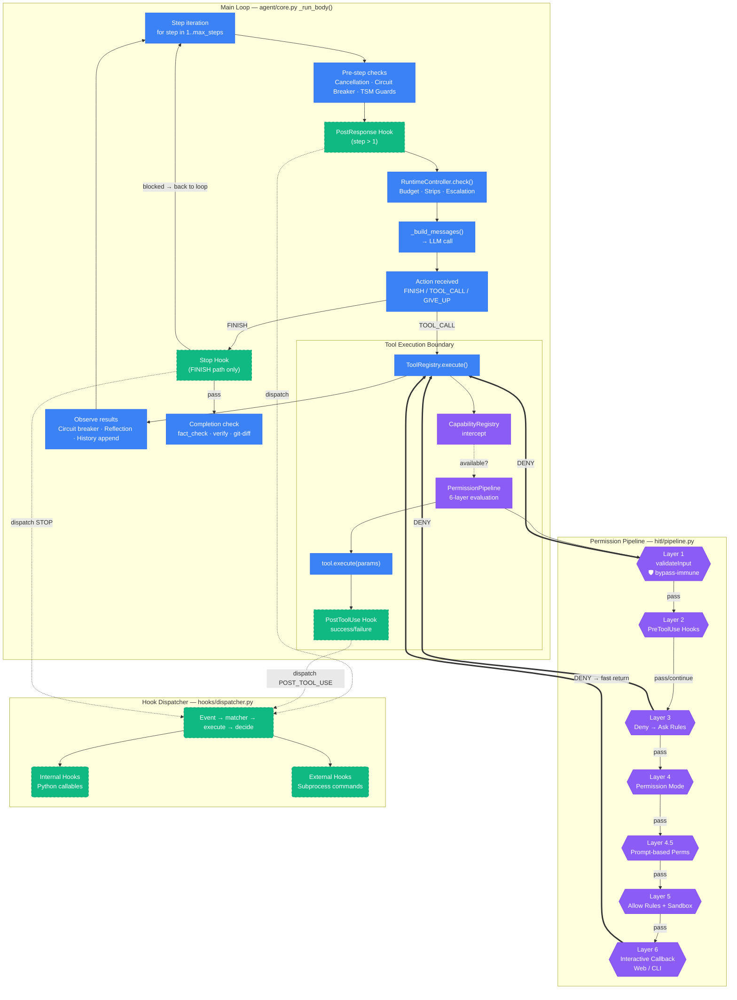

# Phase 5: Cross-Cutting Concerns Review — Main Flow × Permission × Hooks

> 审计日期: 2026-07-23
> 审计范围: `core/base.py` (ToolRegistry.execute), `hitl/pipeline.py` (PermissionPipeline), `hooks/dispatcher.py`, `hooks/registry.py`, `hooks/events.py`, `agent/core.py` (_run_body main loop), `agent/session/registry_builder.py` (wiring)

---

## 1. Mermaid 流程图



### 图审自查

| 模板规则 | 状态 |
|----------|------|
| 主流程节点 ≤ 7 个 | ✅ 7 个 (A→B→C→D→E→F→H→A) |
| Permission 六边形独立子图 | ✅ `subgraph "Permission Pipeline"` |
| Hooks 虚线边框/圆形 | ✅ `classDef hook` 虚线描边 |
| 权限拒绝红色快速返回 | ✅ `==>` 红色箭头 |
| Hook 不指向 LLM API 内部 | ✅ 所有 Hook 连线指向主流程节点或 Tool 边界 |
| Permission 不嵌入 Prompt Assembly | ✅ Layer 都在 Tool 执行入口前 |

---

## 2. 评审检查清单

| 评审维度 | ✅ 合格标准 | ❌ 违规信号 | 当前代码状态 | 改造建议 |
|----------|-----------|-----------|------------|---------|
| **权限位置** | Auth/ACL 在 Tool Executor 边界拦截 | 权限写在 ReAct Loop 的 if-else 里 | ✅ **通过** — [core/base.py:642](core/base.py#L642) `ToolRegistry.execute()` 内`_permission_pipeline.check()`，单一入口 | 无 |
| **Hook 触发方式** | 事件驱动；通过标准 Context 读写 | Hook 硬编码在业务函数体内 | 🟡 **轻微违规** — `_run_stop_hook()` [core.py:2082](agent/core.py#L2082) 和 `_dispatch_post_response()` [core.py:2129](agent/core.py#L2129) 两个不同的 context builder，分别访问不同配置字段 | 统一为一个 `_dispatch_hook(event, context_builder)` 方法 |
| **Hook 职责边界** | Pre-Hook 只校验/增强；Post-Hook 只日志/后处理 | Hook 内部调用 LLM；Hook 承担鉴权 | ✅ **通过** — 所有 Hook 通过 `HookDispatcher.dispatch()` 分发；PreToolUse 结果 `updatedInput` 仅修改参数，不改变决策流 | 无 |
| **失败处理** | 权限拒绝有统一 Error Pipeline 快速短路 | 异常被吞没；权限失败后继续执行 | ✅ **通过** — [core/base.py:645-655](core/base.py#L645) DENY → 立即 `return ToolResult.from_error(PERMISSION_DENIED)`，不执行工具 | 无 |
| **上下文传递** | 不可变 RequestContext 贯穿 | 全局变量传递权限状态 | 🟡 **轻微违规** — [registry_builder.py:175](agent/session/registry_builder.py#L175) 通过 `base_registry._hook_dispatcher` 私有属性访问全局 dispatcher | 改为通过构造函数注入或公开属性 |
| **Hook→LLM 隔离** | Hook 不接触 LLM | Hook 访问 backend/stream/messages | ✅ **通过** — `DispatchResult.additional_context` 被 `_run_stop_hook()` 转为 user message 注入 conversation，但 Hook 本身不调用 LLM | 无 |

---

## 3. 接口契约评审

| 组件 | 当前接口签名 | 问题诊断 | 目标接口签名 |
|------|------------|---------|------------|
| **Permission Middleware** | `PermissionPipeline.check(tool: BaseTool, params: dict, thought: str) → PermissionResult` | ✅ 签名清晰，返回值携带 `decision + reason + layer + updated_params` | 不变 — 已对齐 CC |
| **Hook Dispatcher** | `HookDispatcher.dispatch(event: HookEvent, context: HookContext) → DispatchResult` | 🟡 `HookContext` 有 14 个字段，其中 `messages`, `last_assistant_message`, `stop_hook_active` 与事件类型强耦合 | 拆为 per-event context 子类：`PreToolUseContext`, `StopContext`, `SessionStartContext` |
| **Stop Hook (agent/core)** | `ReActAgent._run_stop_hook(history, *, stop_hook_active, last_assistant_message) → str \| None` | 🔴 **职责越界** — 这个方法在 agent loop 内**手动构建** HookContext、手动调用 dispatcher、手动解释返回值并转为 user message 注入 | `agent.core` 应该只调用 `self._dispatch_stop_hook() → DispatchResult`，由专门的 adapter 负责 context 构建和返回值解释 |
| **PostResponse Hook (agent/core)** | `ReActAgent._dispatch_post_response(history, step) → None` | 🟡 与 `_run_stop_hook` 有重复的 dispatcher fallback 逻辑 | 统一为 `self._dispatch_event(event, context) → DispatchResult` |
| **ToolRegistry.execute** | `ToolRegistry.execute(name, params, thought) → ToolResult` | ✅ 权限在 execute 内同步拦截，返回 `ToolResult.from_error` | 不变 |
| **Registry Builder** | `build_registry_for_session(...)` → ToolRegistry | 🔴 `base_registry._hook_dispatcher` — 访问私有属性 | 公开属性 `registry.hook_dispatcher` |

---

## 4. 深层耦合分析

### 🔴 耦合点 1: Stop Hook 的 context 构建在 agent loop 内

[agent/core.py:2082-2118] — `_run_stop_hook()` 做了三件事：
1. 序列化 `history.to_dicts()` 为 messages
2. 构建 `HookContext(event=STOP, session_id=..., messages=..., agent_id=..., last_assistant_message=..., stop_hook_active=...)`
3. 解释 `DispatchResult` → 返回 `str | None` 作为要注入的 user message

**为什么是耦合**: agent loop 需要知道 STOP hook 需要 `messages`, `last_assistant_message`, `stop_hook_active` 这些字段。这应该是 Hook 系统内部的 context builder 的职责。

```
Before (耦合):
  agent/core.py: _run_stop_hook()
    → 手动构建 HookContext
    → dispatcher.dispatch(STOP, ctx)
    → 手动检查 result.control == BLOCK
    → 手动格式化 result.reason 为 user message
    → 返回 str | None

After (解耦):
  agent/core.py: _run_stop_hook()
    → self._hook_adapter.dispatch_stop(
        history=history,
        session_id=...,
        agent_type=...,
        last_assistant_message=action.message,
      ) → StopHookResult | None
```

### 🔴 耦合点 2: `_run_stop_hook` 访问 `_full_registry._hook_dispatcher`

[agent/core.py:2090-2091]:
```python
dispatcher = self._cfg.hook_dispatcher or getattr(
    self._full_registry, "_hook_dispatcher", None
)
```

这里的 `or` fallback 说明：正常路径通过 `AgentConfig.hook_dispatcher` 传入，兜底路径直接访问 registry 私有属性。两处都可能设置，调用方不知道谁负责——这是一致性问题。

**修复**: 唯一的 hook_dispatcher 入口点。删除 `_full_registry._hook_dispatcher` 访问路径。

### 🟡 耦合点 3: `_dispatch_post_response` 重复 dispatcher 查找

[agent/core.py:2129-2148] 跟 `_run_stop_hook` 有完全相同的 `self._cfg.hook_dispatcher or getattr(self._full_registry, "_hook_dispatcher", None)` 模式。

**修复**: 提取为方法 `_get_hook_dispatcher()`。

### 🟡 耦合点 4: registry_builder 直接操作 `_hook_dispatcher._registry`

[agent/session/registry_builder.py:175-221]:
```python
if hasattr(base_registry, "_hook_dispatcher") and base_registry._hook_dispatcher is not None:
    _session_registry = HookRegistry()
    _session_registry._internal = copy.deepcopy(
        base_registry._hook_dispatcher._registry._internal
    )
    _session_registry._external = copy.deepcopy(
        base_registry._hook_dispatcher._registry._external
    )
```

这里链式访问了三个 private 属性来深拷贝全局 hooks 到 session 级别。

**修复**: `HookDispatcher` 应该暴露 `clone_registry() → HookRegistry` 方法。

---

## 5. "如果去掉这个组件，主流程还能跑吗？" 测试

| 组件 | 去掉后主流程能跑吗？ | 结论 |
|------|-------------------|------|
| **PermissionPipeline** | 能跑 — 工具直接执行，无审批（`ToolRegistry._permission_pipeline` 为 None 时走 legacy HitlManager 或直接跳过） | ✅ 正确设计 — 可选安全层 |
| **PreToolUse Hooks** | 能跑 — `if self._hook_dispatcher:` guard | ✅ 正确设计 — 可选旁路 |
| **PostToolUse Hooks** | 能跑 — `if self._hook_dispatcher:` guard | ✅ 正确设计 — 可选旁路 |
| **Stop Hook** | 能跑 — `if result is not None:` return None 即跳过 | ✅ 正确设计 — 可选拦截点 |
| **PostResponse Hook** | 能跑 — `if dispatcher is None: return` | ✅ 正确设计 — 可选通知 |
| **SessionStart Hook** | 能跑 — 不阻塞执行 | ✅ 正确设计 — 可选通知 |
| **CapabilityRegistry** | 能跑 — `if self._capability_registry is not None:` guard | ✅ 正确设计 — 可选能力门 |

**结论**: 所有 cross-cutting 组件都是真的可选。不存在"去掉就报错"的假 Hook。✅

---

## 6. 评审结论

### 架构健康度评分: **8/10**

| 扣分项 | 分值 |
|--------|------|
| Stop Hook context 构建在 agent loop 内 (-0.5) | 轻度耦合 |
| `_run_stop_hook` 双路径 dispatcher 查找 (-0.5) | 一致性问题 |
| `_dispatch_post_response` 重复 dispatcher 查找 (-0.5) | 重复代码 |
| registry_builder 私有属性链式访问 (-0.5) | 封装破裂 |

---

### P0 阻断性问题

**无。** 没有发现阻断性耦合——Permission Pipeline 在 Tool 边界拦截，Hooks 通过事件驱动异步分发，均可在不修改 Core 的情况下移除。

---

### P1 职责越界问题

#### P1-1: Stop Hook context 构建下沉到 HookAdapter

**当前**: [agent/core.py:2082-2118](agent/core.py#L2082) — `_run_stop_hook()` 在 agent loop 内构建 `HookContext`、调用 dispatcher、解释返回值。

**应该**: 提取专门的 `HookAdapter` 或 `StopHookBridge`，负责：
- 从 agent 内部状态构建 `HookContext`（屏蔽 `messages`, `last_assistant_message` 等细节）
- 调用 `HookDispatcher.dispatch()`
- 返回 `DispatchResult` 或转换为 agent loop 可直接消费的格式

**改造后**:
```python
# agent/core.py — _run_body()
if action.action_type == ActionType.FINISH:
    stop_result = self._stop_hook_bridge.check(
        history=history,
        last_assistant_message=action.message or "",
    )
    if stop_result.blocked:
        history.add(LLMMessage(role="user", content=stop_result.inject_message))
        continue
```

#### P1-2: 统一 dispatcher 获取路径

**当前**: 两处方法（`_run_stop_hook`, `_dispatch_post_response`）都使用相同的双路径模式。

**修复**: 提取 `_get_hook_dispatcher()`:
```python
def _get_hook_dispatcher(self):
    return self._cfg.hook_dispatcher
```
由 `AgentConfig` 作为唯一入口。删除 `getattr(self._full_registry, "_hook_dispatcher", None)` 兜底。

---

### P2 优化建议

#### P2-1: HookDispatcher.clone_registry() 封装

当前 `registry_builder.py:181-185` 直接 `copy.deepcopy` 私有属性 `_registry._internal` / `_registry._external`。应该暴露方法:
```python
class HookDispatcher:
    def clone_registry(self) -> HookRegistry:
        """Return a deep copy suitable for per-session customization."""
```

#### P2-2: HookContext 按事件类拆分

`HookContext` 当前 14 个扁平字段，不同事件用不同子集。建议:
```python
class StopHookContext(HookContext):
    messages: list[dict]
    last_assistant_message: str
    stop_hook_active: bool

class PreToolUseContext(HookContext):
    tool_name: str
    tool_input: dict
```

#### P2-3: HitlManager 彻底移除

`core/base.py:657` 的 `HitlManager` legacy fallback — 如果所有路径都已迁移到 `PermissionPipeline`，可以删除以减少代码路径。

---

### 对标 Claude Code 结论

| 维度 | Grace Code 当前 | Claude Code | 对齐度 |
|------|----------------|-------------|--------|
| Permission 在 Tool 边界 | ✅ `ToolRegistry.execute()` 内同步拦截 | ✅ `ToolPermissionPipeline` 在 tool execution 前 | 对齐 |
| Stop Hook 协议 | ✅ `HookEvent.STOP` + `BLOCKABLE_EVENTS` | ✅ `Stop` event + exit code 2 = block | 对齐 |
| PostToolUse/PostToolUseFailure | ✅ 按 success/failure 分别触发 | ✅ 相同设计 | 对齐 |
| PreToolUse updatedInput | ✅ `perm_result.updated_params` → `actual_params` | ✅ `updatedInput` in control_response | 对齐 |
| Hook 的子进程执行 | ✅ `execute_hook()` via Runtime | ✅ shell script execution | 对齐 |
| Session-scoped hooks | 🟡 registry_builder 手动深拷贝 | Per-session HookDispatcher clone | 需封装 |
